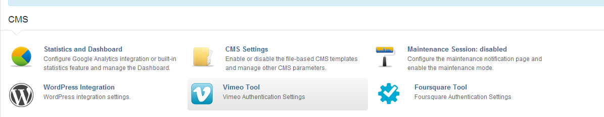

# Vimeo Tool for Lemonstand

Vimeo Tool is a module for the Lemonstand eCommerce platform (http://lemonstand.com) that facilitates the use of the Vimeo PHP Library.

Documentation for the vimeo api can be found here: https://developer.vimeo.com/apis/advanced/ 

## Installation

Clone this repository into modules/ in the root directory of your Lemonstand application

	git clone git://github.com/KB1RMA/ls-module-vimeo_tool.git modules/vimeotool

Vimeo Tool uses a git submodule for the Vimeo PHP library (https://github.com/vimeo/vimeo-php-lib) so be sure to init that before using or you won't get very far.

	git submodule init && git submodule update

The Vimeo Tool module will add a settings page to System > Settings > CMS in the Lemonstand backend where you will enter your Consumer Key and Consumer Secret. You can create these for your application here: https://developer.vimeo.com/apps



After entering your Consumer Key and Consumer Secret, click the 'Authenticate' button and you'll be sent off to Vimeo to grant access. When you return, if all went well, your store will be authenticated and you can now use the class in your partials/pages.

## Example Usage

Grabbing a list of all your uploaded videos:

```php
	<?php $results = VimeoTool_Request::create()->send_request('vimeo.videos.getUploaded'); ?>
```

Looping through all the results and sending them to a partial:

```php
	<? foreach ($results->videos->video as $key=>$video ) : ?>
		<div>
			<? $this->render_partial('vimeo:video_container', array( 'video' => $video, 'width' => 200, 'height' => 134) ) ?>
		</div>
	<? endforeach; ?>
```

This renders the partial 'vimeo:video_container' for each video returned. The contents of 'vimeo:video_container' is as follows:

```php
	<div class="video">
		<iframe src="http://player.vimeo.com/video/<?= $video->id ?>" width="<?= $width ?>" height="<?= $height ?>" frameborder="0" webkitAllowFullScreen mozallowfullscreen allowFullScreen></iframe>
	</div>
	<h1><?= $video->title ?></h1>
	<p><?= date('F d, Y', strtotime($video->upload_date))  ?></p>
```

The response objects for other requests are documented here: https://developer.vimeo.com/apis/advanced#php-response-format

##### Success object
	stdClass Object
	(
	    [generated_in] => 0.0717
	    [stat] => ok
	    [person] => stdClass Object
	        (
	            [id] => 101193
	            [is_plus] => 1
	            [is_staff] => 1
	            [username] => brad
	            [display_name] => Brad Dougherty
	            [location] => Rochester, NY
	            [url] => http://brad.is
	            [number_of_contacts] => 60
	            [number_of_uploads] => 4
	            [number_of_likes] => 215
	            [number_of_videos] => 12
	            [number_of_videos_appears_in] => 8
	            [profileurl] => http://www.vimeo.com/brad/
	            [videosurl] => http://www.vimeo.com/brad/videos/
	        )
	
	)

##### Error object
	stdClass Object
	(
	    [generated_in] => 0.0717
	    [stat] => fail
	    [err] => stdClass Object
	        (
	            [code] => 1
	            [msg] => User Not Found
	        )
	
	)
